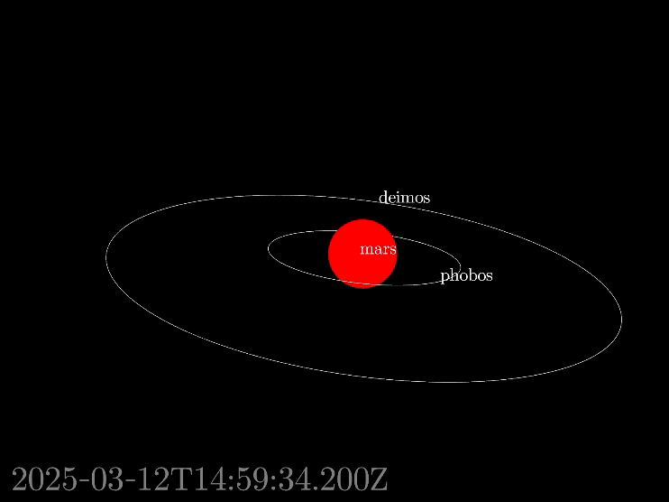
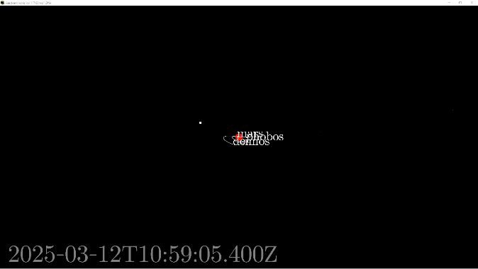

# SPICE for PRo3D and dotnet

This repository provides a library to work with [SPICE](https://naif.jpl.nasa.gov/naif/toolkit.html) platform-indepentently in dotnet by wrapping the native [PRo3D-Extensions](https://github.com/DaKup/PRo3D-Extensions) library and providing easy-to-work-with tools.


While [PRo3D](https://pro3d.space/) uses this library in a more sophisticated way for space-missions, this repository also shows how to render our solarsystem using the [aardvark-platform](https://github.com/aardvark-platform) as rendering-engine.

# Getting spice kernels for testing

Get spice kernels for example from here: [https://s2e2.cosmos.esa.int/bitbucket/scm/spice_kernels/hera.git](https://s2e2.cosmos.esa.int/bitbucket/scm/spice_kernels/hera.git).
The tests per default try to load kernels from this local path `./hera/kernels/mk/hera_crema_2_0_LPO_ECP_PDP.tm`.

```
git clone https://s2e2.cosmos.esa.int/bitbucket/scm/spice_kernels/hera.git
```


# Building & Running the tests

```
dotnet tool restore
dotnet paket restore
dotnet run --project src/PRo3D.SPICE.Tests/PRo3D.SPICE.Tests.fsproj
```
```
[17:16:20 INF] EXPECTO! 6 tests run in 00:00:00.2391825 for init - 6 passed, 0 ignored, 0 failed, 0 errored. Success! <Expecto>
```

# Running the simple rendering demo

```
dotnet run --project src/PRo3D.SPICE.RenderingDemo/PRo3D.SPICE.RenderingDemo.fsproj
```


The code can be modified to also simulate e.g. the planned hera flyby.



# Running the interactive simluation animation tool

will be here shortly.