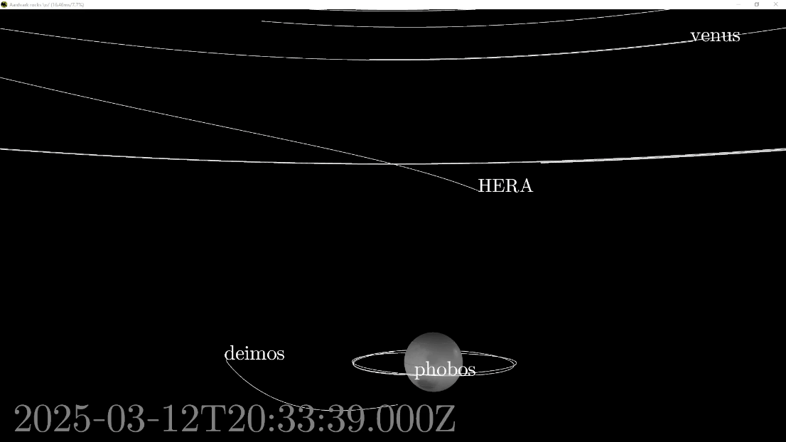
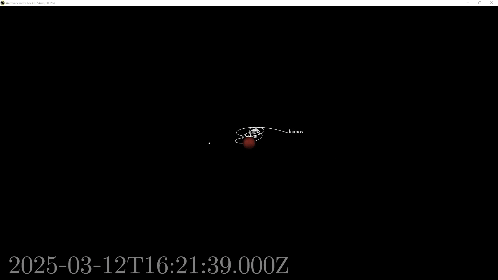

# SPICE for PRo3D and dotnet

This repository provides a library to work with [SPICE](https://naif.jpl.nasa.gov/naif/toolkit.html) platform-indepentently in dotnet by wrapping the native [PRo3D-Extensions](https://github.com/DaKup/PRo3D-Extensions) library written in C++. Moreover, this repository contains:
 * the library accessible as a nuget package,
 * as well as a sample applications which allows to experiment with SPICE and interactive visualizations.


[PRo3D](https://pro3d.space/) uses the library in a more sophisticated way for space-missions. However, just like PRo3D, the visualization component is also written using [the aardvark-platform](https://github.com/aardvark-platform) and shows how to deal with large coordinates and different coordinate frames in graphics applications.


# Getting spice kernels for testing

Get spice kernels for example from here: [https://s2e2.cosmos.esa.int/bitbucket/scm/spice_kernels/hera.git](https://s2e2.cosmos.esa.int/bitbucket/scm/spice_kernels/hera.git).
The tests per default try to load kernels from this local path `./spice_kernels/hera/kernels/mk/hera_crema_2_0_LPO_ECP_PDP.tm`.

```
mkdir spice_kernels
git clone https://s2e2.cosmos.esa.int/bitbucket/scm/spice_kernels/hera.git spice_kernels
```

or use pull the submodule.


# Building & Running the tests

```
dotnet tool restore
dotnet paket restore
dotnet run --project src/PRo3D.SPICE.Tests/PRo3D.SPICE.Tests.fsproj
```
```
[17:16:20 INF] EXPECTO! 6 tests run in 00:00:00.2391825 for init - 6 passed, 0 ignored, 0 failed, 0 errored. Success! <Expecto>
```

# Running the simple rendering demo

```
dotnet run --project src/PRo3D.SPICE.RenderingDemo/PRo3D.SPICE.RenderingDemo.fsproj
```

By setting observer to `mars` we can observe mars and its moons:

By setting observer to `HERA` one can investigate the fly-by and animate the camera:


# Running the interactive simluation animation tool

will be here shortly. 

# Integration in PRo3D

By using PRo3D's rendering real surface data can be rendered together with the simple body representation used in the example:



or impressive fly-by scenarios:




